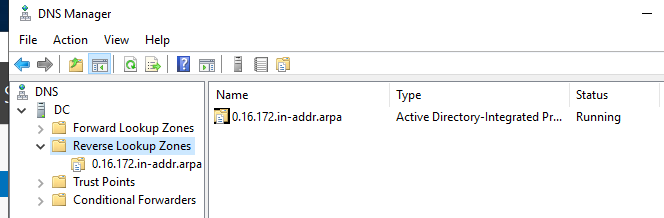

# Issue 3: DHCP Authorization Disconnect

**Environment:** Oracle VirtualBox v7.2.8 / Windows Server 2019 / Windows 10 Pro

## Issue
The computer does not connect to the internet.

## Diagnostics
I ran `ipconfig /all` on the client to check its IP address. The client had an APIPA address.

## Probable Cause 1
A simple misconfiguration caused by the DHCP service.

## Testing Theory 1
I ran `ipconfig /release` and then `ipconfig /renew` to try to get a proper IP address. The client still showed an APIPA address.

## Probable Cause 2
A misconfigured DHCP server, or a broken connection between the DC server and the client.

## Testing Theory 2
On the DC server, I opened the DHCP tool and found that the server was no longer authorized. I tried to authorize it again but was denied with the message: "The specified servers are already specified in the directory service."

## Plan of Action
1. Right-clicked DHCP and opened the Authorization Directory.
2. Unauthorized the server.
3. Closed the window, then authorized the server again.
4. Refreshed the domain. It now shows as authorized with a green check mark.
5. On the client, ran `ipconfig /release` and `ipconfig /renew`.

**Result:** The client received the proper configuration.

## Validation
On the client, `ipconfig /all` showed correct settings. I then opened a web browser and reached YouTube.

## Documentation
The DHCP server was not authorized. I could not unauthorize it from the basic DHCP Manager because the GUI was cached/frozen (it showed the wrong status). I used the Authorization Directory to unauthorize the server, then authorized it again.
