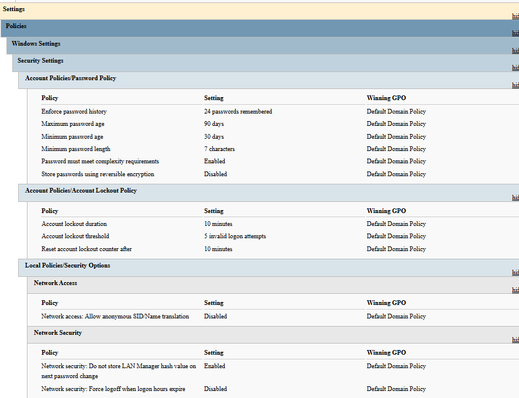
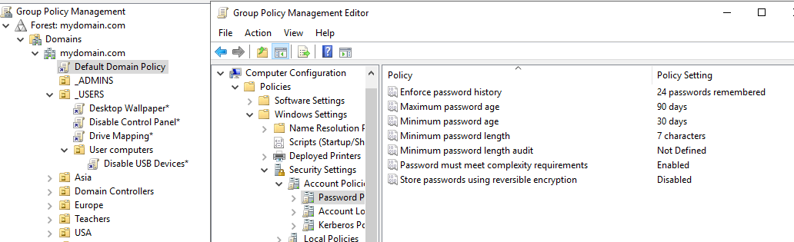
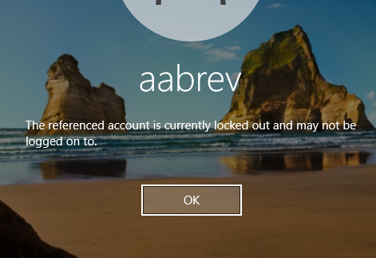

# Issue 5: Account Lockout Policy Not Affecting the Proper OUs

**Environment:** Oracle VirtualBox v7.2.8 / Windows Server 2019 / Windows 10 Pro

## Issue
I logged in as a regular user and failed the login 5 times, but the account was not locked out.

## Diagnostics
- Ran `gpresult /r` to see which policies affect the users on the client. The proper GPOs were applied.
- Ran `gpresult /scope computer /v` to see which GPOs affect the client computer. The proper GPOs were applied there too.

## Probable Cause 1
The GPOs were configured incorrectly and were not affecting the OUs as they should.

## Testing Theory 1
On the DC, I checked the GPOs for the Account Lockout policy. They were configured properly and linked at the top of the hierarchy.

## Probable Cause 2
The GPO was conflicting with the Default Domain Policy.

## Testing Theory 2
On the client, in an admin Command Prompt, I ran `gpresult /h gpreport.html` and opened it with `start gpreport.html`. The report showed an account lockout policy, but it was following the Default Domain Policy.

## Plan of Action
Since removing the Default Domain Policy is not an option, I changed its settings to the lockout and password policies I wanted for the domain. I then deleted my separate Account Lockout and Password Policy GPOs from both the top of the hierarchy and the Group Policy Objects folder.

## Validation
I purposely entered the wrong password 5 times and was locked out.

## Documentation
The Default Domain Policy and my Lockout Policy GPO both defined a lockout policy, so they conflicted, and the result was inconsistent. I removed my duplicate GPOs and changed the Default Domain Policy to match the settings I needed.
